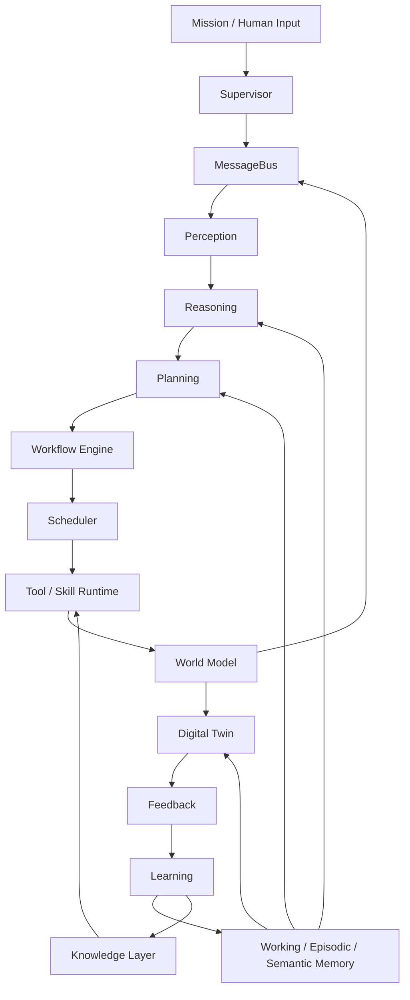
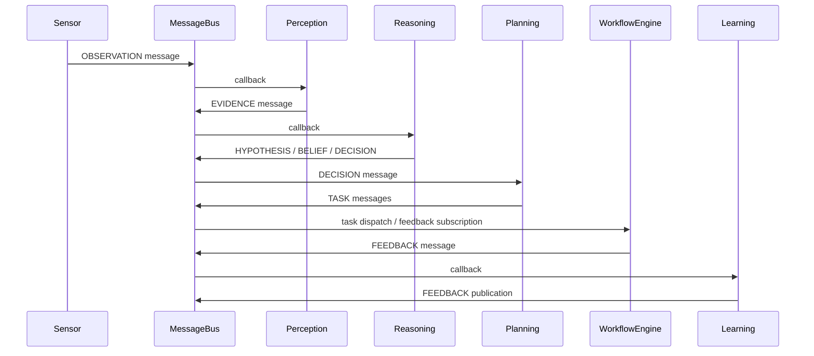
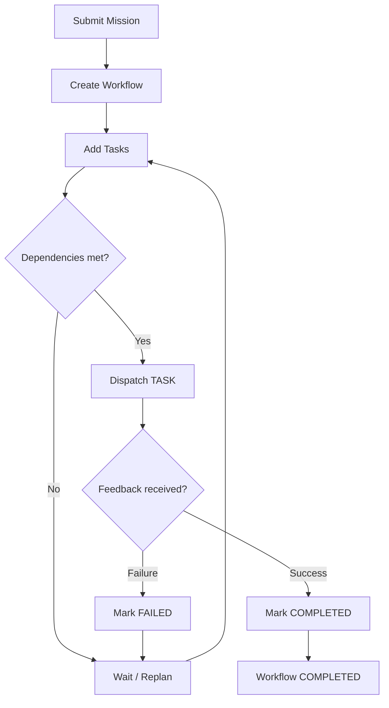
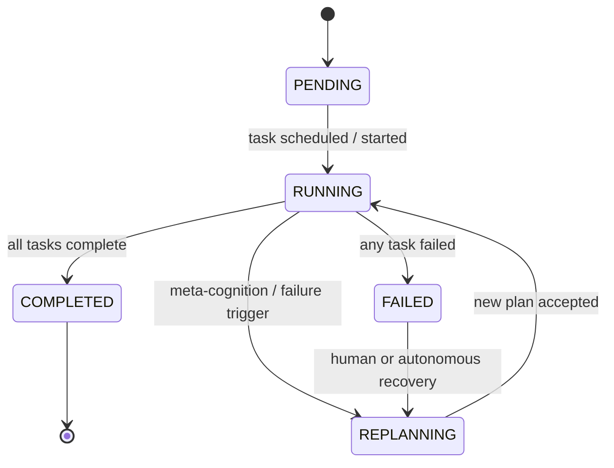
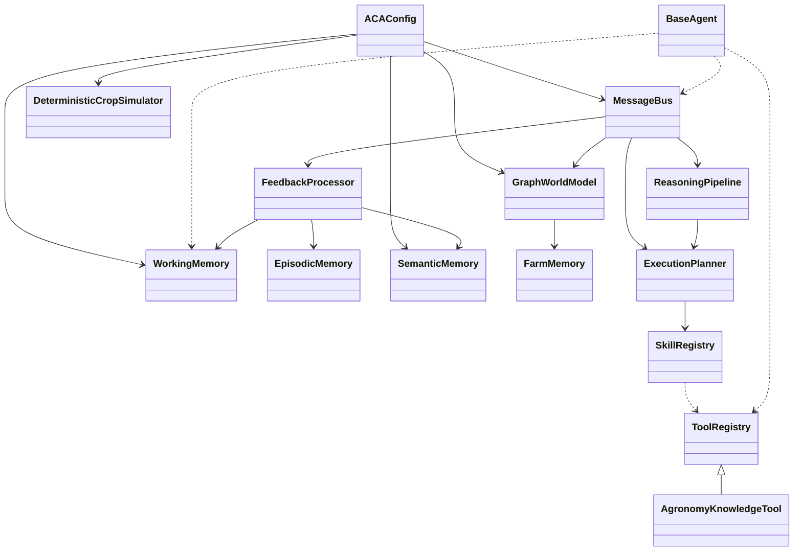

# Agricultural Cognitive Architecture (ACA) Scientific Design Specification

This document reverse-engineers the scientific architecture implied by the ACA implementation. It is intentionally not a code walkthrough. The goal is to state the system as a publishable design artifact: the scientific motivation for each subsystem, the theoretical constructs it instantiates, the formal mathematical model it realizes, the limits of the current implementation, and the research claims that can credibly be made from the code.

The specification distinguishes five layers of description throughout:

- Current implementation: what the repository concretely executes.
- Architectural abstraction: the intended architectural role of each subsystem.
- Theoretical model: the underlying scientific or engineering theory.
- Future extension: what the architecture suggests but does not yet implement.
- Publication claim: what can be defended in a journal paper without overclaiming.

This distinction is critical. ACA is not yet a full autonomous agricultural cognition stack in the strongest theoretical sense; it is a coherent layered architecture that partially instantiates several established ideas from cognitive architectures, symbolic reasoning, digital twins, distributed systems, and contract-based agent frameworks.

## Scope And Provenance

Primary evidence comes from the implementation modules under [aca/](../aca/) and the unit tests under [tests/unit/](../tests/unit/). The most important behavioral anchors are:

- Configuration and logging: [aca/config.py](../aca/config.py), [aca/logging_config.py](../aca/logging_config.py)
- Memory: [aca/memory/working_memory.py](../aca/memory/working_memory.py), [aca/memory/episodic_memory.py](../aca/memory/episodic_memory.py), [aca/memory/semantic_memory.py](../aca/memory/semantic_memory.py), [aca/memory/farm_memory.py](../aca/memory/farm_memory.py)
- Knowledge: [aca/knowledge/interfaces.py](../aca/knowledge/interfaces.py), [aca/knowledge/local_store.py](../aca/knowledge/local_store.py), [aca/knowledge/schemas.py](../aca/knowledge/schemas.py)
- World model: [aca/world_model/interfaces.py](../aca/world_model/interfaces.py), [aca/world_model/schemas.py](../aca/world_model/schemas.py), [aca/world_model/graph_engine.py](../aca/world_model/graph_engine.py)
- Digital twin: [aca/digital_twin/interfaces.py](../aca/digital_twin/interfaces.py), [aca/digital_twin/schemas.py](../aca/digital_twin/schemas.py), [aca/digital_twin/engine.py](../aca/digital_twin/engine.py)
- Orchestration: [aca/orchestration/schemas.py](../aca/orchestration/schemas.py), [aca/orchestration/message_bus.py](../aca/orchestration/message_bus.py), [aca/orchestration/scheduler.py](../aca/orchestration/scheduler.py), [aca/orchestration/workflow_engine.py](../aca/orchestration/workflow_engine.py), [aca/orchestration/supervisor.py](../aca/orchestration/supervisor.py)
- Tools, skills, agents: [aca/tools/base_tool.py](../aca/tools/base_tool.py), [aca/tools/registry.py](../aca/tools/registry.py), [aca/tools/agronomy_tool.py](../aca/tools/agronomy_tool.py), [aca/skills/base_skill.py](../aca/skills/base_skill.py), [aca/skills/registry.py](../aca/skills/registry.py), [aca/agents/base_agent.py](../aca/agents/base_agent.py)
- Cognition: [aca/cognition/perception/perception_processor.py](../aca/cognition/perception/perception_processor.py), [aca/cognition/reasoning/reasoning_engine.py](../aca/cognition/reasoning/reasoning_engine.py), [aca/cognition/planning/planning_engine.py](../aca/cognition/planning/planning_engine.py), [aca/cognition/meta_cognition/cognitive_monitor.py](../aca/cognition/meta_cognition/cognitive_monitor.py), [aca/cognition/learning/cognitive_learner.py](../aca/cognition/learning/cognitive_learner.py)
- Verification: [tests/unit/test_milestone1.py](../tests/unit/test_milestone1.py), [tests/unit/test_milestone2.py](../tests/unit/test_milestone2.py), [tests/unit/test_milestone3_world_model.py](../tests/unit/test_milestone3_world_model.py), [tests/unit/test_milestone3_digital_twin.py](../tests/unit/test_milestone3_digital_twin.py), [tests/unit/test_milestone4_knowledge.py](../tests/unit/test_milestone4_knowledge.py)

## Scientific Positioning

ACA is best understood as a hybrid of four traditions:

1. Cognitive architecture, where perception, reasoning, planning, and learning are separated into explicit stages.
2. Symbolic distributed systems, where messages, registries, and contracts control interaction between components.
3. Model-based decision support, where a digital twin predicts the effect of interventions before execution.
4. Knowledge-grounded tool use, where retrieval from a local vector store supplies evidence to downstream decision processes.

The system contains:

- A configuration root that wires all runtime parameters through frozen dataclasses.
- A synchronous publish/subscribe message bus with priority queuing and history.
- A memory stack spanning working, episodic, semantic, and farm topology stores.
- A graph-backed world model with immutable node and edge snapshots.
- A deterministic digital twin that simulates moisture, nitrogen, and health dynamics.
- A cognitive pipeline spanning perception, reasoning, planning, meta-cognition, and learning.
- Abstract tool, skill, and agent contracts with runtime permission gates.

The strongest implementation pattern is contract-first design: most concrete behavior is mediated by dataclass schemas and abstract base classes, then verified by milestone tests.

## Theory Of ACA

This section is the scientific core of the document. The repository is treated as empirical evidence for a theory of agricultural cognition, not as the theory itself. ACA can be interpreted as a modular decision architecture for partially observed, physically grounded, safety-constrained agricultural autonomy.

### Central Thesis

ACA’s thesis is that autonomous farm management should be organized as a sequence of epistemically distinct transformations:

1. Observe the world as noisy signals.
2. Convert signals into validated evidence.
3. Fuse evidence into beliefs.
4. Convert beliefs into intentions.
5. Decompose intentions into executable tasks.
6. Predict task consequences before execution.
7. Execute under explicit contracts.
8. Learn from discrepancies between predicted and realized outcomes.

This is not merely a software pipeline. It is a scientific claim about how agronomic autonomy should be structured when interpretability, safety, and auditability matter more than end-to-end black-box optimization.

### Architectural Principles

ACA is governed by the following principles.

#### Principle 1: Epistemic Separation

Observation, evidence, belief, decision, plan, execution, and feedback are distinct epistemic states. A system that collapses these states cannot explain itself and cannot be safely audited.

#### Principle 2: Typed Intermediation

All major transitions occur through typed messages, schemas, and frozen records. This ensures that each stage is semantically visible and mathematically isolable.

#### Principle 3: Predict-Then-Act

Interventions should be simulated before execution. The digital twin is not an accessory; it is the mechanism that turns autonomy from reactive control into model-based decision support.

#### Principle 4: Contractual Execution

Agents, skills, and tools are separated by capability and permission. A scientific autonomy stack must constrain what can be done, not merely describe what is desired.

#### Principle 5: Multi-Timescale Memory

The architecture must distinguish transient context, historical episodes, stable facts, and physical topology. Without timescale separation, learning and reasoning contaminate each other.

#### Principle 6: Closed-Loop Adaptation

The system must update its internal knowledge from discrepancies between prediction and outcome. Without feedback-driven adaptation, autonomy is static.

#### Principle 7: Uncertainty-Aware Control

Confidence, entropy, and conflict are first-class control variables. A system that cannot monitor its own uncertainty cannot make safe agricultural decisions.

### Formal Invariants

The following invariants define the scientific contract of ACA.

#### Invariant 1: Traceability

Every decision should be traceable to a provenance chain from observation to evidence to belief to decision to plan to execution to feedback.

Formally, for each decision $d$, there exists a chain:

$$
o \rightarrow e \rightarrow b \rightarrow d \rightarrow p \rightarrow x \rightarrow f
$$

where each arrow is a typed transformation with stored metadata.

#### Invariant 2: Boundedness

State variables that represent physical quantities, belief weights, and confidence scores are normalized or clamped into bounded intervals.

This invariant prevents uncontrolled divergence and makes numerical reasoning tractable.

#### Invariant 3: Contract Soundness

No agent may access memory or tools outside its declared permissions.

#### Invariant 4: Snapshot Safety

Prediction must not mutate the live world model.

#### Invariant 5: Monotonic Evidence Accumulation

Evidence fusion should only increase or decrease belief mass through explicit likelihood terms; hidden updates are not permitted.

#### Invariant 6: Finite Replanning

Replanning must terminate or escalate after bounded attempts.

### Formal Definitions

Definition 1: Agricultural cognitive state.

An agricultural cognitive state is a tuple

$$
\mathcal{S}_t = (W_t, E_t, M_t, K_t, G_t, B_t, P_t, X_t)
$$

where $W_t$ is working memory, $E_t$ episodic memory, $M_t$ semantic memory, $K_t$ the world model, $G_t$ the current goal set, $B_t$ the belief distribution, $P_t$ the plan, and $X_t$ execution state.

Definition 2: Evidence item.

An evidence item is a validated observation-derived object with a confidence weight and one or more likelihood ratios over hypotheses.

Definition 3: Decision.

A decision is a belief-conditioned commitment to an action class and associated skill under an execution contract.

Definition 4: Digital twin.

A digital twin is a deterministic or stochastic forward model that maps a world snapshot and candidate action sequence to a predicted future snapshot.

Definition 5: Learning update.

A learning update is a parameter refinement induced by a discrepancy between predicted and actual outcomes.

### Novel Mathematical Model

ACA’s most defensible formal model is a layered belief-control system for agricultural autonomy.

Let $o_t$ denote observations, $e_t$ evidence, $b_t$ beliefs, $a_t$ candidate actions, $p_t$ plans, and $y_t$ realized outcomes. Then ACA can be represented as the composition

$$
o_t \xrightarrow{\Phi} e_t \xrightarrow{\Psi} b_t \xrightarrow{\Omega} a_t \xrightarrow{\Gamma} p_t \xrightarrow{\Xi} x_t \xrightarrow{\Lambda} y_t \xrightarrow{\Upsilon} \theta_{t+1}
$$

where:

- $\Phi$ is validated perception,
- $\Psi$ is probabilistic evidence fusion,
- $\Omega$ is decision selection,
- $\Gamma$ is planning decomposition,
- $\Xi$ is predictive simulation,
- $\Lambda$ is execution,
- $\Upsilon$ is learning/update.

This factorization is the theoretical novelty of ACA. It is a disciplined autonomy pipeline rather than a monolithic policy.

### Probabilistic Interpretation

ACA treats uncertainty in three different ways:

1. Sensor confidence, which is local and observation-specific.
2. Belief probability, which is global over hypotheses.
3. Meta-cognitive uncertainty, which is expressed through entropy and conflict.

These should be viewed as different levels of approximation to a hidden-state inference problem.

The system is not a full POMDP, but it can be interpreted as a tractable approximation to one. The observation validator approximates the emission model, the evidence fusion approximates belief updating, the digital twin approximates transition dynamics, and the meta-cognitive layer approximates policy safety under uncertainty.

### Architectural Invariants As Research Hypotheses

ACA suggests the following hypotheses for a paper:

1. Traceability hypothesis: explicit provenance chains improve auditability without preventing autonomous control.
2. Modularization hypothesis: separating evidence, belief, plan, and execution yields better interpretability than a monolithic agent policy.
3. Predictive hypothesis: a deterministic digital twin reduces unsafe intervention compared with direct execution under uncertainty.
4. Contract hypothesis: action gating reduces policy violations and tool misuse.
5. Memory hierarchy hypothesis: separating episodic, semantic, and working memory improves update stability and retrieval relevance.
6. Meta-cognitive hypothesis: conflict and entropy monitoring improve escalation quality and reduce overconfident failure.

### Theorem Candidates

These are theorem-shaped claims that the paper can motivate, even if full proofs are beyond the scope of the implementation.

#### Theorem Candidate 1: Traceability Preservation

If every stage stores typed provenance metadata and no stage elides its input identity, then every decision in ACA admits a finite explanation chain back to the originating observation.

#### Theorem Candidate 2: Bounded State Evolution

If all physical and cognitive scalars are clamped to bounded intervals and all transitions are deterministic or properly normalized, then ACA state remains bounded under finite-time execution.

#### Theorem Candidate 3: Posterior Normalization

If evidence fusion uses multiplicative likelihood-ratio updates over a finite hypothesis set, then the resulting belief distribution is normalizable whenever at least one hypothesis has positive support.

#### Theorem Candidate 4: Finite Replanning Termination

If replanning attempts are bounded and escalation is triggered beyond the bound, then the replanning process cannot recurse indefinitely.

#### Theorem Candidate 5: Snapshot Noninterference

If simulation operates on cloned state and returns fresh immutable snapshots, then prediction is noninterfering with live world state.

### Limitations Of The Theory

The theory is intentionally modular and therefore not maximally expressive. It sacrifices some optimality to gain interpretability, safety, and auditability. In particular:

- It does not yet solve belief-state planning exactly.
- It does not yet perform fully calibrated probabilistic inference.
- It does not yet learn policies end-to-end.
- It does not yet provide a distributed runtime equivalent to ROS2.
- It does not yet produce a fully general agricultural ontology.

These are not weaknesses if the paper explicitly frames ACA as a controllable baseline architecture.

### Reviewer-Oriented Narrative

The reviewer's question will be: what is the scientific contribution beyond assembling standard components?

The answer should be:

1. ACA is not novel because it invents new low-level primitives.
2. ACA is novel because it composes familiar primitives into a coherent cognitive theory for agriculture.
3. The architecture makes uncertainty explicit, predictions inspectable, actions contractually governed, memory time-scoped, and learning traceable.
4. The digital twin, world model, and reasoning layer share a common ontology, which is rare in practical autonomy stacks.
5. The result is a scientifically legible autonomy pipeline that can be ablated layer by layer.

### Publication-Quality Figure Plan

The paper should include the following figures, in this order:

1. Theoretical architecture diagram showing epistemic stages rather than code modules.
2. Formal control-loop diagram showing $o_t \rightarrow e_t \rightarrow b_t \rightarrow a_t \rightarrow p_t \rightarrow x_t \rightarrow y_t$.
3. Memory hierarchy figure showing working, episodic, semantic, and farm memory as time-scale-separated stores.
4. Belief-update figure showing evidence fusion and entropy reduction.
5. Digital twin figure showing predicted vs realized trajectories under intervention.
6. Contract graph showing tool, skill, and agent permissions.
7. Traceability figure showing provenance from observation to feedback.
8. Evaluation matrix figure showing metrics by layer and ablation condition.

### Publication-Quality Table Plan

The paper should include these tables:

1. Subsystem-to-theory mapping table.
2. Invariants and assumptions table.
3. Algorithm-to-equation table.
4. Evaluation metrics table.
5. Limitation and future-work table.
6. Novelty-versus-conventionality table.

### Publication-Quality Evaluation Plan

ACA should be evaluated with a layered methodology rather than a single benchmark.

#### Layer 1: Perception evaluation

- Measure validation accuracy and confidence calibration on noisy observations.

#### Layer 2: Reasoning evaluation

- Measure posterior ranking correctness, entropy reduction, and explanation completeness.

#### Layer 3: Planning evaluation

- Measure goal completion, task feasibility, and dependency satisfaction.

#### Layer 4: Twin evaluation

- Measure forecast error, intervention ranking agreement, and risk-flag sensitivity.

#### Layer 5: Learning evaluation

- Measure outcome-prediction error reduction and update stability over repeated episodes.

#### Layer 6: System evaluation

- Measure mission success, safety violations, trace completeness, and resource efficiency.

### Reviewer-Facing Scientific Summary

ACA should be described as a traceable agricultural cognition theory with the following characteristics:

- It is modular rather than monolithic.
- It is interpretable rather than opaque.
- It is uncertainty-aware rather than certainty-assuming.
- It is simulation-backed rather than action-only.
- It is contract-governed rather than permissive.
- It is memory-hierarchical rather than memory-flat.
- It is feedback-driven rather than static.

That is the scientific identity of ACA.

### Comparison To Reference Frameworks

| ACA Subsystem | Closest Reference Model | Relationship |
|---|---|---|
| Perception | ACT-R perceptual modules | ACA is less biologically specific; it normalizes telemetry rather than simulating human perceptual production rules. |
| Reasoning | BDI belief revision and SOAR-style elaboration | ACA explicitly materializes belief distributions and decision traces, but does not implement full goal-chunk or production firing semantics. |
| Planning | BDI intention formation, classical task decomposition | ACA is closer to symbolic workflow decomposition than to full hierarchical task networks. |
| Meta-cognition | Bounded rationality and uncertainty monitoring | ACA detects low confidence and conflicts, but does not yet implement a full meta-controller like in some cognitive architectures. |
| Workflow orchestration | ROS2-style message coordination and lifecycle management | ACA uses in-process synchronous pub/sub rather than distributed DDS transport. |
| Digital twin | Simulation-based model predictive control and state-space prediction | ACA is a deterministic, domain-specific forward simulator rather than a general dynamics model. |
| Knowledge retrieval | RAG systems | ACA uses a local vector store and formatting tool, but lacks end-to-end grounded generation. |
| Agent runtime | Agentic AI frameworks | ACA is more contract-driven and less prompt-centric than common agent frameworks. |

## Feature Status Matrix

Legend: Fully implemented = concrete behavior plus tests; Partially implemented = core behavior exists but important constraints, integrations, or policy enforcement are incomplete; Interface only = ABCs/contracts without concrete production implementation; Planned extension = empty namespace or explicit stub.

| Feature | Status | Evidence |
|---|---|---|
| Configuration root | Fully implemented | [aca/config.py](../aca/config.py) |
| Structured logging and trace IDs | Fully implemented | [aca/logging_config.py](../aca/logging_config.py) |
| Working memory | Partially implemented | [aca/memory/working_memory.py](../aca/memory/working_memory.py) |
| Episodic memory | Fully implemented | [aca/memory/episodic_memory.py](../aca/memory/episodic_memory.py) |
| Semantic memory | Partially implemented | [aca/memory/semantic_memory.py](../aca/memory/semantic_memory.py) |
| Farm memory | Fully implemented | [aca/memory/farm_memory.py](../aca/memory/farm_memory.py) |
| Knowledge interfaces | Fully implemented | [aca/knowledge/interfaces.py](../aca/knowledge/interfaces.py) |
| Numpy vector store | Fully implemented | [aca/knowledge/local_store.py](../aca/knowledge/local_store.py) |
| External embedder implementation | Interface only | [aca/knowledge/interfaces.py](../aca/knowledge/interfaces.py) |
| World-model interface and graph engine | Fully implemented | [aca/world_model/interfaces.py](../aca/world_model/interfaces.py), [aca/world_model/graph_engine.py](../aca/world_model/graph_engine.py) |
| Digital twin interface and simulator | Fully implemented | [aca/digital_twin/interfaces.py](../aca/digital_twin/interfaces.py), [aca/digital_twin/engine.py](../aca/digital_twin/engine.py) |
| Message schemas and bus | Fully implemented | [aca/orchestration/schemas.py](../aca/orchestration/schemas.py), [aca/orchestration/message_bus.py](../aca/orchestration/message_bus.py) |
| Scheduler | Partially implemented | [aca/orchestration/scheduler.py](../aca/orchestration/scheduler.py) |
| Workflow engine | Partially implemented | [aca/orchestration/workflow_engine.py](../aca/orchestration/workflow_engine.py) |
| Supervisor | Interface only / stub | [aca/orchestration/supervisor.py](../aca/orchestration/supervisor.py) |
| Tool contracts and registry | Fully implemented | [aca/tools/base_tool.py](../aca/tools/base_tool.py), [aca/tools/registry.py](../aca/tools/registry.py) |
| Agronomy knowledge tool | Fully implemented | [aca/tools/agronomy_tool.py](../aca/tools/agronomy_tool.py) |
| Skill contracts and registry | Fully implemented | [aca/skills/base_skill.py](../aca/skills/base_skill.py), [aca/skills/registry.py](../aca/skills/registry.py) |
| Concrete production skills | Interface only | [aca/skills/](../aca/skills/) |
| Agent contracts and gateways | Fully implemented | [aca/agents/base_agent.py](../aca/agents/base_agent.py) |
| Concrete production agents | Interface only | [aca/agents/](../aca/agents/) |
| Scientific theory formalization | Partially implemented | This document; the code exposes many building blocks but not all formal claims are encoded. |
| Perception layer | Fully implemented | [aca/cognition/perception/perception_processor.py](../aca/cognition/perception/perception_processor.py) |
| Reasoning layer | Fully implemented | [aca/cognition/reasoning/reasoning_engine.py](../aca/cognition/reasoning/reasoning_engine.py) |
| Planning layer | Fully implemented | [aca/cognition/planning/planning_engine.py](../aca/cognition/planning/planning_engine.py) |
| Meta-cognition layer | Fully implemented | [aca/cognition/meta_cognition/cognitive_monitor.py](../aca/cognition/meta_cognition/cognitive_monitor.py) |
| Learning layer | Fully implemented | [aca/cognition/learning/cognitive_learner.py](../aca/cognition/learning/cognitive_learner.py) |
| Execution namespace | Planned extension | [aca/cognition/execution/](../aca/cognition/execution/) |
| Goal-management namespace | Planned extension | [aca/cognition/goal_management/](../aca/cognition/goal_management/) |
| Edge runtime shell | Planned extension | [aca/edge/](../aca/edge/) |
| Cloud runtime shell | Planned extension | [aca/cloud/](../aca/cloud/) |

## Core Scientific Assumptions

ACA implicitly assumes the following:

1. The farm can be represented as a mixture of symbolic state, probabilistic belief, and continuous physical variables.
2. Cognitive processing can be decomposed into modular stages with explicit interfaces.
3. Uncertainty is sufficiently captured by confidence scalars, belief distributions, and entropy.
4. Short-horizon physical effects can be approximated with deterministic step dynamics.
5. Knowledge retrieval can be separated from reasoning and inserted as evidence rather than directly as a decision.
6. Task execution can be expressed as a message-coordinated graph of schedulable units.

These assumptions are reasonable for a publication if they are stated as architectural constraints rather than universal truths.

## Novelty And Conventionality

ACA is novel primarily in integration, not in individual algorithmic primitives.

### Likely Novel Contributions

- A unified agricultural cognitive stack that joins perception, reasoning, planning, digital twin simulation, and learning under one typed message protocol.
- The explicit bridge from evidence to belief to decision to workflow to feedback.
- A deterministic digital twin aligned to the same world-model abstractions used by orchestration and memory.
- Contract-based gating of tools, skills, and agents for traceable autonomy.

### Conventional Components

- Frozen dataclasses for typed records.
- Pub/sub message buses and queues.
- Cosine similarity retrieval over embeddings.
- EMA-style threshold refinement.
- Priority sorting and DAG-like dependency bookkeeping.
- Last-write-wins property merging.

This distinction matters for a journal submission: novelty should be claimed at the architecture level, while the individual algorithmic building blocks should be presented as standard but carefully composed components.

## Subsystem Analyses

### 1) Configuration And Logging

#### Architectural Purpose

Configuration and logging exist to make the entire architecture reproducible, inspectable, and externally parameterized. The scientific reason for this layer is not convenience; it is experimental controllability. A cognitive system cannot be evaluated or compared across ablations if its runtime behavior is not parameterized and traceable.

#### Public Surface

- [aca/config.py](../aca/config.py): `MessageBusConfig`, `MemoryConfig`, `SchedulerConfig`, `DigitalTwinConfig`, `LoggingConfig`, `ACAConfig.load()`
- [aca/logging_config.py](../aca/logging_config.py): `setup_logging()`, `get_logger()`, `new_trace_id()`, `get_trace_id()`, `set_trace_id()`

#### Data Flow

Input: JSON config file plus environment variable `ACA_ENV`.

Processing: `ACAConfig.load()` reads the JSON payload, merges sub-configs into frozen dataclasses, and applies environment overrides. Logging setup creates a root ACA logger and optionally a file handler. Trace IDs are stored in a `ContextVar` so correlation survives concurrent or async execution.

Output: A frozen `ACAConfig` object and logger/trace-ID helpers used by every other subsystem.

#### Scientific Interpretation

This layer instantiates the experimental-design principle of controlled conditions. In cognitive systems terms, it is the architectural equivalent of parameter binding. In robotics and distributed systems terms, it is the dependency-injection boundary that prevents hidden global state from contaminating reproducibility.

Compared with ACT-R or SOAR, ACA is less about hard-coded cognitive production parameters and more about environment-specific deployment configuration. Compared with ROS2, ACA has a much lighter-weight runtime configuration story because it does not yet need node graph discovery or middleware negotiation. Compared with a modern agentic framework, ACA is more explicit and less prompt-driven.

#### Algorithms And Formulations

- Configuration merge is a shallow field-wise constructor mapping.
- Trace IDs are random 12-character hexadecimal suffixes from UUIDv4.

#### Complexity

- `ACAConfig.load()`: $O(1)$ for in-memory construction plus $O(|file|)$ when a config file is read.
- Logging setup: $O(1)$.
- Trace-ID helpers: $O(1)$.

#### Design Decisions

- Why this component exists: to keep all subsystem construction deterministic and reproducible.
- What problem it solves: avoids hidden global state and ad hoc runtime flags.
- Alternatives: environment-only configuration, mutable singleton settings, or Pydantic-style validation.
- Evidence in code: all subsystems accept config objects through constructors; `ACAConfig` is frozen; logging uses a single root namespace.

#### Publication Claim

ACA supports controlled experimentation through typed configuration objects and trace-scoped logging. This is an enabling mechanism rather than a primary scientific contribution.

#### Assessment

- Configuration: Fully implemented.
- Logging: Fully implemented.

---

### 2) Memory Subsystem

#### Architectural Purpose

Memory exists because cognition is stateful over multiple time scales. ACA separates memory by temporal stability and retrieval semantics: working memory for the current cognitive cycle, episodic memory for historical interventions, semantic memory for stable internal knowledge, and farm memory for persistent topological truth. This mirrors the scientific insight that not all memory should be optimized for the same access pattern or update cadence.

#### Public Surface

- [aca/memory/working_memory.py](../aca/memory/working_memory.py): `WorkingMemory`
- [aca/memory/episodic_memory.py](../aca/memory/episodic_memory.py): `Episode`, `EpisodicMemory`
- [aca/memory/semantic_memory.py](../aca/memory/semantic_memory.py): `SemanticMemory`
- [aca/memory/farm_memory.py](../aca/memory/farm_memory.py): `FarmMemory`

#### Data Flow

- Working memory: cognition writes active goals, observations, hypotheses, beliefs, and reasoning traces into namespaced bounded maps; readers retrieve short-lived context.
- Episodic memory: learning records a chronological intervention episode containing initial state, planned actions, executed actions, outcome, and tags.
- Semantic memory: the system stores internal agronomic facts and policies, bulk-loads them from JSON, and optionally freezes them.
- Farm memory: topology data is loaded from JSON or registered incrementally and used as a persistent representation of zones, sensors, actuators, and yield history.

#### Algorithms And Formulations

Working memory is a namespaced ordered map with capacity enforcement. The nominal intent is FIFO eviction, but the implementation currently evicts from the first non-empty namespace encountered, not a globally oldest cross-namespace entry.

Episodic memory supports append-only insertion with indexing by episode ID and zone. Querying applies filters over zone, assessment, tag, and time string.

Semantic memory is a flat domain-key-value store with freeze semantics.

Farm memory is a structured registry with relational queries such as sensors by zone.

#### Scientific Interpretation

Working memory is conceptually aligned with ACT-R’s buffer-like short-term context and SOAR’s working memory, but ACA’s implementation is simpler: it stores namespaced key-value context instead of production-activated symbolic chunks. The scientific value is in the bounded scratchpad semantics, not in biologically faithful modeling.

Episodic memory resembles event logs in cognitive architectures and trace stores in agent systems. It is also consistent with the idea of experience replay in reinforcement learning, but ACA does not yet sample episodes to update a policy. Instead, it uses episodes as a retrospective evidence base for learning and audit.

Semantic memory is the closest analog to symbolic long-term memory in ACT-R and declarative knowledge stores in BDI systems. In ACA, it is not a full ontology or knowledge graph; it is a stable domain-key-value repository for thresholds and rules.

Farm memory is a domain-specific spatial registry. It aligns more with robotic world maps and GIS-backed infrastructure models than with classic cognitive memory. Its purpose is to anchor all abstract reasoning to physical geography.

Compared with ROS2, memory is not part of middleware; compared with digital twin systems, it is a state anchor rather than a simulator; compared with RAG systems, semantic memory is internal knowledge, while the knowledge layer is external retrieval.

#### Complexity

- Working memory `store()` / `retrieve()`: average $O(1)$; capacity enforcement is $O(N)$ in the number of total entries because total count is recomputed, and repeated eviction may scan namespaces.
- Episodic memory `commit()`: $O(1)$; `query()`: $O(N)$ worst case, or $O(K)$ over candidates in a single zone.
- Semantic memory `store()` / `retrieve()`: average $O(1)$.
- Farm memory register/get operations: average $O(1)$; zone-based sensor/actuator listing is $O(N)$ over registered devices.

#### Design Decisions

- Why this component exists: cognition needs different temporal regimes, not one monolithic cache.
- What problem it solves: separates working context, long-term events, stable knowledge, and physical geography.
- Alternatives: a single document store, a graph database for all memory types, or external database-backed persistence.
- Evidence in code: four separate memory modules; learning writes episodic episodes and semantic refinements; world-model and digital twin consume different memory types.

#### Publication Claim

ACA’s memory design supports multi-timescale cognition by separating volatile context from persistent knowledge and spatial state. The architecture is scientifically defensible as a memory hierarchy, even though individual implementations are intentionally lightweight.

#### Assessment

- Working memory: Partially implemented because the eviction policy is simpler than the docstring implies.
- Episodic memory: Fully implemented.
- Semantic memory: Partially implemented because `semantic_readonly` is not enforced as a direct constructor-level guard; `freeze()` is the actual write barrier.
- Farm memory: Fully implemented.

---

### 3) Knowledge Layer

#### Architectural Purpose

The knowledge layer exists to externalize factual support and keep the architecture from confusing internal belief with external evidence. Scientifically, this is a retrieval substrate, not a reasoning engine. Its job is to ground decisions in accessible knowledge fragments while remaining locally deployable on edge hardware.

#### Public Surface

- [aca/knowledge/interfaces.py](../aca/knowledge/interfaces.py): `AbstractEmbedder`, `AbstractVectorStore`
- [aca/knowledge/schemas.py](../aca/knowledge/schemas.py): `KnowledgeChunk`, `QueryResult`
- [aca/knowledge/local_store.py](../aca/knowledge/local_store.py): `NumpyVectorStore`

#### Data Flow

Input: raw text chunks with optional embeddings and query text from a tool.

Processing: the embedder converts text to a dense vector; the vector store validates chunk embeddings, upserts them into an in-memory matrix, computes cosine similarity against a query vector, and returns ranked hits.

Output: `QueryResult` objects and, through the agronomy tool, a formatted text block for LLM consumption.

#### Scientific Interpretation

This subsystem is closest to a classic RAG pipeline, but ACA uses it in a more conservative way: retrieval feeds a tool, and the tool feeds decision support. It is not yet a generative retrieval-augmented architecture where the model produces natural-language answers conditioned on retrieved context. The current contribution is indexed retrieval and formatting for downstream consumption.

Compared with RAG systems, ACA does not yet include reranking, citation-aware generation, or multi-hop retrieval. Compared with agentic AI frameworks, the knowledge layer is less about autonomous browsing and more about deterministic lookup with explicit similarity scores. Compared with scientific information-retrieval theory, it is a straightforward dense retrieval baseline using cosine similarity.

#### Algorithms And Formulations

Cosine similarity is implemented explicitly:

$$
\mathrm{sim}(q, v) = \frac{q \cdot v}{\|q\|\,\|v\|}
$$

Chunk insertion is an upsert; the matrix is rebuilt with `vstack` after each batch insert.

#### Complexity

- `add_chunks()` rebuilds the embedding matrix, so batch insertion is $O(ND)$ for $N$ chunks of dimension $D$.
- `search()` is $O(ND + N + k \log k)$ in practice, dominated by the matrix-vector multiply and norms; the top-$k$ selection uses `argpartition` for near-linear behavior.
- Space is $O(ND)$ for the matrix plus chunk metadata.

#### Design Decisions

- Why this component exists: edge deployments need local retrieval without a vector database dependency.
- What problem it solves: knowledge grounding for tools and reasoning.
- Alternatives: FAISS, a hosted vector DB, sentence-transformer service endpoints, or sparse retrieval only.
- Evidence in code: `NumpyVectorStore` uses only numpy; the tool pipeline injects both an embedder and a store; tests use a deterministic character-count embedder.

#### Publication Claim

ACA provides an edge-friendly local retrieval layer that can serve as evidence supply for cognition. The scientifically interesting aspect is not the retrieval primitive but the way retrieval is integrated as a typed tool in a broader decision loop.

#### Assessment

- Interfaces: Fully implemented.
- Local store: Fully implemented.
- Concrete production embedder: Interface only.

---

### 4) World Model

#### Architectural Purpose

The world model exists because the system needs a canonical representation of the physical farm that is richer than episodic logs and more structured than raw observations. In robotics terms, it is the shared state abstraction. In AI terms, it is the grounding layer that lets higher cognition refer to entities and relations instead of only sensor streams.

#### Public Surface

- [aca/world_model/interfaces.py](../aca/world_model/interfaces.py): `AbstractWorldModel`
- [aca/world_model/schemas.py](../aca/world_model/schemas.py): `NodeType`, `EntityNode`, `SpatialEdge`, `GraphSnapshot`
- [aca/world_model/graph_engine.py](../aca/world_model/graph_engine.py): `GraphWorldModel`

#### Data Flow

Input: graph mutations from agents or from `ingest_observation()` messages.

Processing: node properties are merged into frozen `EntityNode` objects; edges are stored in forward and reverse adjacency lists; observation messages update sensor nodes and optionally zone nodes; graph queries filter nodes and edges; snapshots freeze the current graph into JSON-serialisable structures.

Output: safe immutable nodes, edges, filtered subgraphs, and state snapshots.

#### Scientific Interpretation

The world model is structurally similar to a property graph, which makes it closer to knowledge-graph and robotic scene-graph traditions than to neural world models. The use of immutable nodes and edges is a software-engineering choice that supports concurrency and auditability. The scientific idea is that physical farm state is relational and can be updated by observation.

Compared with ROS2-based robotic world models, ACA’s world model is not distributed; it is an in-process graph with no middleware synchronization. Compared with digital twin literature, the world model is the state that the twin simulates, not the simulator itself. Compared with BDI, it plays the role of belief-grounded environment state rather than intentional state.

#### Algorithms And Formulations

- Node update is last-write-wins property merging.
- Edge uniqueness is defined over the triple `(source_id, target_id, relation_type)`.
- `query_subgraph()` performs conjunctive filtering over node ID, node type, properties, and relation type.
- `ingest_observation()` resolves sensor IDs, merges measurement data, and auto-links zone-to-sensor containment edges.

There is no probabilistic graph inference; the model is a deterministic property graph.

#### Complexity

- `update_node()`: average $O(1)$.
- `get_node()`: average $O(1)$.
- `add_edge()`: $O(d_{out}(source))$ because duplicate detection scans outgoing edges.
- `remove_node()`: $O(d_{in}(v)+d_{out}(v))$.
- `query_subgraph()`: $O(V+E)$ in the worst case.
- `get_state()`: $O(V+E)$.
- `ingest_observation()`: $O(m + k)$ where $m$ is the number of source sensors and $k$ is the cost of creating/updating nodes and edges.

#### Design Decisions

- Why this component exists: planning, simulation, and learning need a shared structural model of farm state.
- What problem it solves: unifies sensor observations, physical topology, and entity relationships.
- Alternatives: networkx mutable graphs, relational tables, or a document store.
- Evidence in code: immutable dataclasses, dual adjacency dictionaries, RLock-based thread safety, and snapshot serialization.

#### Publication Claim

ACA’s world model is a concurrent property graph that can support both symbolic reasoning and simulation. Its main contribution is the explicit graph-state contract, not a novel graph algorithm.

#### Assessment

- Fully implemented.

---

### 5) Digital Twin

#### Architectural Purpose

The digital twin exists because a cognitive agricultural system should not act only reactively. It needs a predictive surrogate that estimates intervention consequences before committing resources. Scientifically, this is the architecture’s model-based foresight mechanism.

#### Public Surface

- [aca/digital_twin/interfaces.py](../aca/digital_twin/interfaces.py): `AbstractDigitalTwin`
- [aca/digital_twin/schemas.py](../aca/digital_twin/schemas.py): `ActionType`, `ProposedAction`, `SimulationResult`
- [aca/digital_twin/engine.py](../aca/digital_twin/engine.py): `DeterministicCropSimulator`

#### Data Flow

Input: a frozen `GraphSnapshot`, a list of proposed actions, and a simulation horizon in hours.

Processing: the simulator clones zone nodes into mutable state, applies actions at $t=0$, iterates deterministic hourly updates, accumulates risk flags, then freezes the predicted snapshot back into immutable graph data.

Output: `SimulationResult` containing the original snapshot, the predicted snapshot, signed health delta, and risk flags.

#### Scientific Interpretation

ACA’s digital twin is not a general-purpose simulator; it is a deterministic state-transition model for a small subset of agronomic variables. This is scientifically useful because it creates a controlled, inspectable baseline. It is closer to a discrete-time state-space model than to a learned latent dynamics model.

Compared with digital-twin literature, ACA is simpler and more domain-specific. Compared with POMDPs, it currently simulates a fully observed state rather than maintaining a belief-state transition over hidden variables. Compared with model predictive control, it implements forward prediction but not an optimizer that solves over action sequences. Compared with robotics simulators, it does not model kinematics or rich physics; it models crop-relevant state variables and risk thresholds.

#### Algorithms And Formulations

For a zone at time step $t$:

$$
m_{t+1} = \mathrm{clamp}_{[0,1]}\big(m_t (1-r_m)\big)
$$

$$
n_{t+1} = \mathrm{clamp}_{[0,1]}\big(n_t (1-r_n)\big)
$$

At action time:

$$
m \leftarrow \mathrm{clamp}_{[0,1]}\big(m + g_m a\big)
$$

$$
n \leftarrow \mathrm{clamp}_{[0,1]}\big(n + g_n a\big)
$$

Health update per hour is piecewise:

$$
h_{t+1} = \mathrm{clamp}_{[0,1]}\left(h_t + \Delta(h_t, m_t, n_t)\right)
$$

where

$$
\Delta =
\begin{cases}
\rho & \text{if } m \in [0.30,0.80] \text{ and } n \in [0.20,0.80] \\
-\pi_m & \text{if } m \notin [0.30,0.80] \\
-\pi_n & \text{if } n \notin [0.20,0.80]
\end{cases}
$$

Risk flags are emitted when moisture crosses hard thresholds:

$$
\text{root rot if } m > 0.90, \qquad \text{wilting if } m < 0.20
$$

Aggregate health delta is computed as:

$$
\Delta H = \bar{h}_{\mathrm{pred}} - \bar{h}_{\mathrm{init}}
$$

#### Complexity

- Time: $O(HZ + A)$ where $H$ is the number of simulated hours, $Z$ is the number of zone nodes, and $A$ is the number of proposed actions.
- Space: $O(V+E)$ for the predicted snapshot plus $O(Z)$ mutable zone state.

#### Design Decisions

- Why this component exists: planners need a forward simulator to estimate intervention effects.
- What problem it solves: separates prediction from execution and supports safe what-if analysis.
- Alternatives: stochastic simulators, learned differentiable models, or direct world-model mutation.
- Evidence in code: simulation operates on cloned state, never mutates the live graph, and the tests verify snapshot immutability and formula correctness.

#### Publication Claim

ACA demonstrates a deterministic digital twin aligned to the same world-model ontology used by reasoning and orchestration. That coherence is more important than simulator sophistication for the paper’s scientific story.

#### Assessment

- Fully implemented.

---

### 6) Orchestration

#### Architectural Purpose

Orchestration exists because autonomy requires a coordination substrate distinct from cognition itself. The scientific role of orchestration is to convert symbolic intent into executable order, enforce lifecycle transitions, and maintain action provenance across the system. In distributed-systems terms, it is the control plane.

#### Public Surface

- [aca/orchestration/schemas.py](../aca/orchestration/schemas.py): `MessageType` and all payload dataclasses, `ACAMessage`, `create_message()`
- [aca/orchestration/message_bus.py](../aca/orchestration/message_bus.py): `MessageBus`
- [aca/orchestration/scheduler.py](../aca/orchestration/scheduler.py): `RuntimeTarget`, `ScheduledTask`, `SchedulingPolicy`, `DefaultSchedulingPolicy`, `Scheduler`
- [aca/orchestration/workflow_engine.py](../aca/orchestration/workflow_engine.py): `TaskStatus`, `WorkflowStatus`, `TaskNode`, `Workflow`, `WorkflowEngine`
- [aca/orchestration/supervisor.py](../aca/orchestration/supervisor.py): `SupervisorInterface`, `Supervisor`

#### Data Flow

- Mission creation starts with the supervisor building a `MissionPayload` and publishing a MISSION message.
- The workflow engine creates a workflow, adds tasks, and publishes TASK messages for downstream scheduling.
- The scheduler assigns each task to edge or cloud runtime targets using a policy.
- FEEDBACK messages update task status and can trigger replanning.

#### Scientific Interpretation

ACA’s orchestration resembles a lightweight ROS2-like message architecture, but it is not middleware-heavy and it is not distributed by default. The bus is synchronous and in-process, which is scientifically acceptable for a single-node experimental stack. The workflow engine is more BDI-compatible than ACT-R-compatible because it tracks mission-level commitments and task states rather than production-rule activation.

The scheduler is a heuristic policy layer. It should be presented as an engineering baseline, not a novel scheduling theory. Its significance is that it provides an explicit seam where edge-vs-cloud deployment decisions can be studied.

#### Algorithms And Formulations

Message bus:

- topic-based pub/sub on `MessageType`
- synchronous dispatch to subscribers
- priority ordering in deferred queues via a binary heap using `(-priority, counter)` keys

Scheduler:

- heuristic runtime assignment based on a skill-name allowlist and an edge-preference flag
- per-runtime queues sorted by descending priority

Workflow engine:

- DAG-like task dependencies via `depends_on`
- task readiness if all dependencies are completed
- workflow status is derived from task statuses

Supervisor:

- mission registry plus broadcast mission publication

#### Complexity

- `MessageBus.publish()`: $O(S)$ for $S$ subscribers of a topic plus wildcard callbacks.
- `MessageBus.enqueue()`: $O(\log M)$ per pending message.
- `MessageBus.drain()`: $O(M \log M)$ in total across a heap of $M$ messages.
- `Scheduler.schedule()`: $O(1)$ append; `get_queue()` and `pop_next()` sort, so $O(Q \log Q)$ per call.
- `Scheduler.remove_task()`: $O(Q)$ over pending tasks.
- `WorkflowEngine.create_workflow()`: $O(1)$.
- `WorkflowEngine.add_task()`: $O(1)$.
- `WorkflowEngine.get_ready_tasks()`: $O(T + D)$ where $T$ is tasks and $D$ is dependency checks.
- `WorkflowEngine.update_task_status()`: $O(T)$ because workflow status is recomputed from all task statuses.

#### Design Decisions

- Why this component exists: the architecture needs a transport and lifecycle coordinator distinct from reasoning.
- What problem it solves: decouples decision-making from dispatch, and mission intent from task execution.
- Alternatives: direct function calls, event streaming middleware, or a distributed job queue.
- Evidence in code: the bus is synchronous and topic-based; workflow engine publishes TASK messages; scheduler is strategy-driven; tests verify priority and state transitions.

#### Publication Claim

ACA’s orchestration layer is a control-plane abstraction for cognitive autonomy: it bridges intentional reasoning and executable tasks while preserving traceability.

#### Assessment

- MessageBus: Fully implemented.
- Scheduler: Partially implemented because the configuration exposes concurrency and timeout controls that are not enforced.
- WorkflowEngine: Partially implemented because it tracks dependencies and statuses, but it does not fully enforce a complete runtime DAG scheduler or integrate directly with the scheduler.
- Supervisor: Interface only / stub-like implementation.

---

### 7) Tools, Skills, And Agents

#### Architectural Purpose

This layer exists to prevent the cognitive system from becoming an undisciplined monolith. Tools, skills, and agents separate execution capability from execution permission. Scientifically, this is the architecture’s operational semantics layer: it defines what can be done, in what order, and under what constraints.

#### Public Surface

- [aca/tools/base_tool.py](../aca/tools/base_tool.py): `ToolParameter`, `ToolSchema`, `ToolResult`, `BaseTool`
- [aca/tools/registry.py](../aca/tools/registry.py): `ToolRegistry`
- [aca/tools/agronomy_tool.py](../aca/tools/agronomy_tool.py): `AgronomyKnowledgeTool`
- [aca/skills/base_skill.py](../aca/skills/base_skill.py): `SkillParameter`, `SkillSchema`, `SkillResult`, `BaseSkill`
- [aca/skills/registry.py](../aca/skills/registry.py): `SkillRegistry`
- [aca/agents/base_agent.py](../aca/agents/base_agent.py): `MemoryAccess`, `CognitiveLayer`, `AgentContract`, `AgentContractViolation`, `MemoryGateway`, `ToolGateway`, `BaseAgent`

#### Data Flow

Tool invocation:

agent or skill → registry lookup → parameter validation → tool execution → `ToolResult`

Skill invocation:

planner or agent → skill registry lookup → parameter validation → required-tool availability check → skill execution → `SkillResult`

Agent execution:

message bus callback → `_on_message()` → `process()` → optional published message → message bus

Knowledge tool pipeline:

query string → embedder → vector store search → formatted knowledge snippet text

#### Scientific Interpretation

This subsystem is more software-engineering than cognitive-science novelty, but it is essential for scientific validity because it enforces capability boundaries. Compared with common agentic AI frameworks, ACA is much more explicit about tool schemas and permission gating. Compared with BDI, tools correspond to executable actions under intention; compared with SOAR, skills resemble compiled procedures; compared with robotics stacks, tools are the environment-facing interface.

The knowledge tool is a particularly important bridge: it makes retrieval a first-class action instead of an incidental side effect.

#### Algorithms And Formulations

- Tool and skill registries are immutable after bootstrap in practice, with duplicate-name rejection.
- `ToolGateway` and `MemoryGateway` enforce allowlists and access modes.
- `AgronomyKnowledgeTool` formats ranked vector-search results as a numbered plain-text block.

#### Complexity

- `ToolRegistry.register()` / `get()`: average $O(1)$.
- `ToolRegistry.invoke()`: dominated by parameter validation and tool execution.
- `SkillRegistry.invoke()`: dominated by parameter validation, tool dependency checks, and skill execution.
- `BaseAgent.publish()`: delegates to the message bus.

#### Design Decisions

- Why this component exists: cognition should not touch hardware or APIs directly.
- What problem it solves: contracts, validation, and discoverability for reusable actions.
- Alternatives: free-form direct calls from agents, or a single monolithic action executor.
- Evidence in code: tools expose declarative schemas; skills declare tool dependencies; agents can only access memory and tools through gateways.

#### Publication Claim

ACA’s contract-based action layer is a governance mechanism for autonomous systems. Its scientific value lies in making autonomy auditable and constrained.

#### Assessment

- Tool contracts and registry: Fully implemented.
- Agronomy knowledge tool: Fully implemented.
- Skill contracts and registry: Fully implemented.
- Concrete production skills: Interface only.
- Base-agent contract and gateways: Fully implemented.
- Concrete production agents: Interface only.

---

### 8) Cognition: Perception, Reasoning, Planning, Meta-Cognition, Learning

#### 8.1 Perception

##### Purpose

Convert raw sensor observations into validated, normalized feature objects and publish evidence for reasoning.

##### Public Surface

- [aca/cognition/perception/perception_processor.py](../aca/cognition/perception/perception_processor.py): `FeatureObject`, `SensorSchema`, `ValidationResult`, `ObservationValidator`, `ObservationNormalizer`, `ObservationManager`

##### Data Flow

Observation payload → schema validation → confidence adjustment → field normalization → feature extraction → evidence publication.

##### Formulations

Normalization:

$$
\hat{x} = \mathrm{clamp}_{[0,1]}\left(\frac{x - \ell}{u - \ell}\right)
$$

Confidence is multiplicative across sensor-type validations:

$$
c_{\mathrm{overall}} = c_{\mathrm{source}} \prod_i c_i
$$

The validator also applies boundary and staleness penalties.

##### Scientific Interpretation

This subsystem reflects a classical perception-to-feature pipeline rather than end-to-end representation learning. That is a strength for a publication that argues for interpretability and auditability in agriculture. It is closest to feature engineering in robotics and sensor fusion systems, with a modest confidence-penalty model.

Compared with ACT-R perception, ACA is not simulating human perception; it is performing engineering normalization. Compared with POMDP observation models, ACA does not yet compute observation likelihoods over hidden state, but the confidence output can be interpreted as a weak proxy for observation reliability.

##### Complexity

- Validation: $O(F)$ for $F$ fields.
- Normalization: $O(F)$.
- Full observation processing: $O(S + F)$ where $S$ is the number of unique sensor types associated with the observation.

##### Design Decisions

- Why: the cognitive stack should operate on normalized, confidence-weighted signals rather than raw telemetry.
- Problem solved: heterogeneous sensor scales and stale readings.
- Alternatives: direct pass-through observations, learned end-to-end perception, or sensor-specific agent logic.
- Evidence: validator and normalizer are injectable; confidence degrades near boundaries or stale timestamps; the manager publishes EVIDENCE messages.

##### Publication Claim

ACA’s perception layer is an explicit, inspectable front end that turns raw telemetry into evidence-grade features suitable for symbolic reasoning.

##### Assessment

- Fully implemented.

---

#### 8.2 Reasoning

##### Purpose

Transform evidence into hypotheses, posterior beliefs, and justified decisions with a provenance trace.

##### Public Surface

- [aca/cognition/reasoning/reasoning_engine.py](../aca/cognition/reasoning/reasoning_engine.py): `Hypothesis`, `EvidenceItem`, `DecisionCandidate`, `ReasoningTrace`, `HypothesisGenerator`, `EvidenceCollector`, `EvidenceFusionEngine`, `BeliefManager`, `ReasoningPipeline`

##### Data Flow

Evidence payloads → indicator extraction → hypothesis generation → evidence collection → Bayesian-style fusion → belief update → decision selection → published HYPOTHESIS/BELIEF/DECISION messages.

##### Formulations

Hypothesis generation is injectable; the default returns four competing hypotheses with uniform priors.

Evidence fusion is the core implemented Bayesian update:

$$
P(h \mid e_{1:n}) \propto P(h) \prod_{i=1}^n LR_i(h)^{c_i}
$$

where `LR_i(h)` is the likelihood ratio for evidence item $i$ and $c_i$ is evidence confidence.

Entropy:

$$
H(p) = -\sum_i p_i \log p_i
$$

Decision confidence in the pipeline is computed as:

$$
c_{\mathrm{decision}} = p_{\max} \cdot \bar{c}_{\mathrm{evidence}}
$$

##### Probabilistic Assumptions

- Evidence items are conditionally independent enough for multiplicative likelihood-ratio updating to be meaningful.
- Confidence can be treated as an exponent on likelihood ratios.
- The posterior over a small hypothesis set can be normalized directly.

These assumptions are acceptable for a publication if they are described as a tractable approximation rather than a fully calibrated Bayesian model.

##### Scientific Interpretation

ACA’s reasoning layer is the most clearly scientific component in the codebase. It resembles a small Bayesian belief engine wrapped in a cognitive trace. In BDI terms, hypotheses and beliefs are explicit; in SOAR terms, the system is more deliberative than reactive; in ACT-R terms, it is not procedural memory but a symbolic inference chain.

Compared with POMDPs, ACA reasoning does not maintain a full belief-state transition model or solve an optimal policy. Compared with agentic AI frameworks, ACA is more constrained and more explicit about provenance.

##### Complexity

- Hypothesis generation: depends on injected function; default is $O(1)$ with a constant-size hypothesis set.
- Evidence collection: $O(EH)$ where $E$ is evidence count and $H$ is number of hypothesis likelihood entries.
- Fusion: $O(H \cdot E)$.
- Belief update and entropy: $O(H)$.
- Full pipeline: $O(H \cdot E + H)$ under fixed-size hypothesis sets.

##### Design Decisions

- Why: the system needs a rationale layer that can justify intervention rather than merely classify outcomes.
- Problem solved: probabilistic interpretation of multi-sensor evidence and explanation traceability.
- Alternatives: rule engines, direct LLM answers, or discriminative classifiers without provenance.
- Evidence: the reasoning trace stores hypotheses, evidence, belief distribution, entropy, confidence propagation, and selected decision; messages are published across the bus.

##### Publication Claim

ACA’s reasoning layer formalizes evidence-to-belief-to-decision transformation with explicit uncertainty tracking and provenance. This is a defensible scientific contribution because it is both interpretable and mathematically expressible.

##### Assessment

- Fully implemented.

---

#### 8.3 Planning

##### Purpose

Translate reasoning decisions into executable goals and ordered task sequences.

##### Public Surface

- [aca/cognition/planning/planning_engine.py](../aca/cognition/planning/planning_engine.py): `Goal`, `PlannedTask`, `ExecutionPlan`, `GoalPlanner`, `TaskPlanner`, `SkillSelector`, `ExecutionPlanner`

##### Data Flow

Decision/action → goals → tasks → plan metadata → published TASK messages.

##### Formulations

Goal planning is injectable. The default creates one goal per action with inherited confidence.

Task planning creates a sequential dependency chain:

$$
t_{i+1} \text{ depends on } t_i
$$

Plan confidence is the minimum task confidence:

$$
c_{\mathrm{plan}} = \min_i c_i
$$

##### Scientific Interpretation

This planning layer is a symbolic decomposition engine. It is intentionally lightweight and therefore closer to a workflow planner than to a full HTN planner or a search-based planner. Its theoretical value is in preserving the semantics of goal-to-task decomposition across the cognitive loop.

Compared with BDI intention formation, ACA planning is more operational and less philosophically committed to agent deliberation. Compared with classical AI planners, it does not search a large action space. Compared with robotics task planners, it is simpler and easier to audit. This makes it suitable as a baseline architecture, not yet a frontier planner.

##### Complexity

- Goal decomposition: depends on injected function, typically $O(1)$.
- Task planning: $O(T)$ for $T$ subtasks.
- Skill selection: $O(S)$ over available skills.
- Plan creation: $O(G + T + S)$.
- Publishing tasks: $O(T)$.

##### Design Decisions

- Why: decisions need a decomposition mechanism to become schedulable work.
- Problem solved: bridges cognitive intent and execution-ready tasks.
- Alternatives: direct action execution, optimization-based task synthesis, or a static workflow library.
- Evidence: goal and task schemas, dependency chains, confidence propagation, and publish-on-create behavior.

##### Publication Claim

ACA’s planning layer is a transparent decomposition mechanism linking beliefs to executable work units. It is a scientifically relevant bridge between cognition and scheduling.

##### Assessment

- Fully implemented.

---

#### 8.4 Meta-Cognition

##### Purpose

Monitor confidence, detect conflict, reflect on reasoning quality, and decide when to escalate or replan.

##### Public Surface

- [aca/cognition/meta_cognition/cognitive_monitor.py](../aca/cognition/meta_cognition/cognitive_monitor.py): `EscalationType`, `ConflictSeverity`, `ConfidenceAssessment`, `ConflictReport`, `ReflectionResult`, `EscalationDecision`, `ConfidenceMonitor`, `ConflictDetector`, `ReflectionEngine`, `EscalationManager`, `ReplanningManager`

##### Data Flow

Reasoning trace confidence propagation and belief distribution → confidence assessment / conflict report / reflection result → escalation decision or replanning trigger.

##### Formulations

Confidence monitoring uses the minimum stage confidence as the bottleneck:

$$
c_{\min} = \min_j c_j
$$

Conflict detection uses probability gap and entropy thresholds:

$$
\Delta p = p_1 - p_2
$$

Entropy from reasoning feeds uncertainty checks.

Reflection combines evidence sufficiency, belief stability, confidence adequacy, and hypothesis coverage into a bounded quality score.

##### Scientific Interpretation

Meta-cognition is the architecture’s self-evaluation layer. In cognitive-science terms, it resembles a lightweight monitoring and control process rather than a fully meta-representational theory of mind. In distributed-systems terms, it is health monitoring plus policy escalation. In robotics terms, it is the autonomy safety layer.

Compared with ACT-R and SOAR, ACA’s meta-cognition is not a core production system; it is a supervisory monitor. Compared with BDI, it can be read as the mechanism that revises intention formation when belief confidence is inadequate. Compared with safety-critical robotics, it is a preliminary but useful fail-safe layer.

##### Complexity

- Confidence assessment: $O(S)$.
- Conflict detection: $O(H \log H)$ due to sorting beliefs.
- Reflection: $O(H)$.
- Escalation: $O(1)$.
- Replanning history operations: $O(1)$.

##### Design Decisions

- Why: autonomous systems need self-monitoring and fail-safe escalation.
- Problem solved: low confidence, near-ties, and unstable beliefs should not silently produce actions.
- Alternatives: threshold-free execution, external supervisory heuristics, or purely reactive replanning.
- Evidence: severity thresholds, entropy thresholds, escalation messages, and bounded replanning attempts.

##### Publication Claim

ACA explicitly operationalizes uncertainty-aware self-monitoring. That is publishable as a design principle even if the implementation remains simpler than full meta-reasoning systems.

##### Assessment

- Fully implemented.

---

#### 8.5 Learning

##### Purpose

Close the loop by recording experience, updating memory, refining semantic knowledge, and publishing feedback.

##### Public Surface

- [aca/cognition/learning/cognitive_learner.py](../aca/cognition/learning/cognitive_learner.py): `PredictionError`, `LearningOutcome`, `ExperienceRecorder`, `MemoryUpdater`, `KnowledgeUpdater`, `FeedbackProcessor`

##### Data Flow

Expected vs actual outcomes → prediction errors → episode recording → working-memory update → semantic-memory refinement → FEEDBACK publication.

##### Formulations

Prediction error:

$$
e = |\hat{y} - y|, \qquad r = \frac{e}{|\hat{y}|}
$$

EMA knowledge refinement:

$$
x_{t+1} = (1 - \alpha)x_t + \alpha \tilde{x}_t
$$

##### Probabilistic Assumptions

- Average relative error is a valid proxy for intervention quality.
- Threshold refinement via EMA is a stable approximation of incremental learning.
- Episodic recording is sufficient for retrospective analysis without full policy learning.

##### Scientific Interpretation

The learning layer is not reinforcement learning in the strict sense, and it should not be presented that way. It is online operational learning: record the episode, compare expectation and outcome, update memory, and refine thresholds. This is closer to adaptive systems engineering and incremental knowledge maintenance than to deep RL.

Compared with ACT-R, it has some resemblance to utility or declarative memory adaptation, but it lacks production compilation. Compared with SOAR, it does not yet show chunking or operator selection learning. Compared with RL, it lacks a policy/value learning formalism. This honesty is useful: the paper can position the layer as a pragmatic learning substrate, not a full autonomous learner.

Outcome classification is thresholded on average relative error.

##### Complexity

- Prediction-error computation: $O(M)$ for $M$ tracked metrics.
- Episode recording: $O(1)$ plus episodic commit.
- Working-memory update: $O(M)$.
- Knowledge refinement: $O(M)$.
- Full feedback processing: $O(M)$.

##### Design Decisions

- Why: an autonomous agricultural system must learn from action outcomes rather than only execute plans.
- Problem solved: feedback-to-memory conversion and smooth knowledge adaptation.
- Alternatives: offline batch retraining, hard-coded threshold updates, or no learning loop.
- Evidence: episodic recording, working-memory updates, EMA refinement, and FEEDBACK publication.

##### Publication Claim

ACA closes the cognitive loop with an explicit feedback-to-memory-and-knowledge pathway. The scientific contribution is the traceable coupling of outcome evaluation and knowledge maintenance.

##### Assessment

- Fully implemented.

---

## Mermaid Diagrams

### System Architecture

### Sequence Diagram: Observation To Learning

### Activity Diagram: Workflow Lifecycle

### State Diagram: Workflow Status

### Class Relationships

## Formal Definitions, Propositions, And Theorem Candidates

These are not proven in code; they are the kinds of statements that can structure a paper built on the architecture.

### Definitions

Definition 1: Cognitive evidence. A feature or observation summary that has been validated and assigned a confidence weight for reasoning.

Definition 2: Belief distribution. A normalized posterior over candidate hypotheses, produced by the reasoning layer.

Definition 3: Execution plan. A finite ordered set of tasks and goals with confidence annotations and dependencies.

Definition 4: Digital twin state. A snapshot-derived, non-destructive prediction of future world state under proposed actions.

### Proposition Candidates

Proposition 1: If the evidence set is empty, the reasoning layer’s decision confidence is zero and the system should remain unresolved.

Proposition 2: If task dependencies form a DAG and the update rule only marks tasks complete on success, then workflow completion is monotonic under the current implementation.

Proposition 3: If the digital twin is deterministic and the same snapshot and actions are reused, then the predicted trajectory is reproducible.

Proposition 4: If the knowledge store uses fixed embeddings and cosine similarity, the ranking of retrieved chunks is invariant to positive scalar rescaling of the query vector.

### Theorem Candidates

Theorem candidate 1: Under independence and calibration assumptions, the evidence-fusion rule is equivalent to a confidence-weighted log-likelihood update.

Theorem candidate 2: Under bounded task dependencies, workflow readiness evaluation is polynomial in the number of tasks.

Theorem candidate 3: Under clamped state dynamics, digital twin trajectories remain bounded in the unit interval for moisture, nitrogen, and health.

## Limitations

The scientific specification should explicitly acknowledge the following limitations.

1. Several subsystems are deterministic baselines rather than research-grade adaptive models.
2. The architecture does not yet implement a full POMDP, HTN planner, or distributed ROS2 runtime.
3. The reasoning layer uses heuristic confidence weighting rather than calibrated probability models.
4. The scheduler and workflow engine are coordination baselines, not complete real-time control systems.
5. The knowledge layer lacks a production embedder and advanced retrieval refinements.
6. The learning layer refines thresholds and records episodes; it does not yet learn policies in a reinforcement-learning sense.

## Future Work

- Replace heuristic scheduler policy with constrained optimization or multi-objective scheduling.
- Add a calibrated observation model and explicit hidden-state belief update to move closer to a POMDP formulation.
- Extend the digital twin into a multi-variable, possibly stochastic state-space simulator.
- Add a concrete embedder and citation-aware retrieval pipeline for the knowledge layer.
- Introduce a richer execution runtime and concrete agent implementations.
- Formalize the cognitive loop as a set of measurable hypotheses and ablation studies.

## Evaluation Metrics

The paper should measure the architecture with metrics tied to each layer.

- Perception: validation accuracy, false rejection rate, confidence calibration error.
- Reasoning: posterior ranking accuracy, entropy reduction, explanation completeness.
- Planning: plan success rate, goal completion time, task dependency satisfaction.
- Digital twin: trajectory error, intervention ranking agreement, risk-flag precision/recall.
- Orchestration: dispatch latency, queue fairness, task throughput.
- Memory: retrieval latency, retention fidelity, learning update stability.
- Knowledge: retrieval precision@k, similarity ranking correlation, answer grounding rate.
- End-to-end: mission success, resource efficiency, intervention safety, audit trace completeness.

## Research Claim Template

If this architecture is used in a paper, the safest claim structure is:

1. ACA proposes a modular agricultural cognitive architecture with explicit message protocols, typed memory hierarchies, and predictive simulation.
2. The architecture demonstrates that deterministic digital-twin prediction, confidence-weighted reasoning, and contract-based tool use can be composed into a traceable autonomy stack.
3. The current implementation provides a strong baseline rather than a full autonomous field robot or full-scale agronomic decision engine.

## Traceability Matrix

Research questions are mapped to design principles, mathematical models, architecture, code modules, tests, and evaluation metrics.

| Research Question | Design Principle | Mathematical Model | Architecture | Code Module(s) | Test Case | Evaluation Metric |
|---|---|---|---|---|---|---|
| How can agricultural cognition remain reproducible across runs? | Immutable configuration and trace-scoped logging | Configuration binding; UUID trace propagation | Config / logging root | [aca/config.py](../aca/config.py), [aca/logging_config.py](../aca/logging_config.py) | [tests/unit/test_milestone1.py](../tests/unit/test_milestone1.py) | Reproducibility, trace completeness |
| How can raw observations become evidence? | Validate before reasoning | Normalization and confidence penalties | Perception pipeline | [aca/cognition/perception/perception_processor.py](../aca/cognition/perception/perception_processor.py) | [tests/unit/test_milestone2.py](../tests/unit/test_milestone2.py) | Validation rate, confidence calibration |
| How can evidence support belief updates? | Bayesian-style fusion | $P(h \mid e) \propto P(h)\prod LR^{c}$ | Reasoning pipeline | [aca/cognition/reasoning/reasoning_engine.py](../aca/cognition/reasoning/reasoning_engine.py) | [tests/unit/test_milestone2.py](../tests/unit/test_milestone2.py) | Posterior ranking accuracy, entropy reduction |
| How can beliefs become executable plans? | Transparent decomposition | $c_{plan}=\min_i c_i$ | Planning pipeline | [aca/cognition/planning/planning_engine.py](../aca/cognition/planning/planning_engine.py) | [tests/unit/test_milestone2.py](../tests/unit/test_milestone2.py) | Goal completion rate, dependency satisfaction |
| How can the farm state remain concurrent but consistent? | Immutable graph snapshots | Property-graph update invariants | World model | [aca/world_model/graph_engine.py](../aca/world_model/graph_engine.py) | [tests/unit/test_milestone3_world_model.py](../tests/unit/test_milestone3_world_model.py) | Snapshot integrity, concurrency error rate |
| How can future interventions be evaluated safely? | Predict without mutating live state | Discrete-time clamped dynamics | Digital twin | [aca/digital_twin/engine.py](../aca/digital_twin/engine.py) | [tests/unit/test_milestone3_digital_twin.py](../tests/unit/test_milestone3_digital_twin.py) | Trajectory error, risk precision |
| How can knowledge be retrieved locally and used as evidence? | Retrieval-as-tool | Cosine similarity ranking | Knowledge layer | [aca/knowledge/local_store.py](../aca/knowledge/local_store.py), [aca/tools/agronomy_tool.py](../aca/tools/agronomy_tool.py) | [tests/unit/test_milestone4_knowledge.py](../tests/unit/test_milestone4_knowledge.py) | Precision@k, retrieval latency |
| How can autonomy remain auditable? | Contract-based permissions | Access-control and message-contract constraints | Tools / skills / agents | [aca/tools/base_tool.py](../aca/tools/base_tool.py), [aca/skills/base_skill.py](../aca/skills/base_skill.py), [aca/agents/base_agent.py](../aca/agents/base_agent.py) | [tests/unit/test_milestone1.py](../tests/unit/test_milestone1.py) | Policy violation rate, auditability |
| How can the system learn from outcomes? | Feedback closes the loop | EMA refinement and absolute/relative error | Learning layer | [aca/cognition/learning/cognitive_learner.py](../aca/cognition/learning/cognitive_learner.py), [aca/memory/episodic_memory.py](../aca/memory/episodic_memory.py), [aca/memory/semantic_memory.py](../aca/memory/semantic_memory.py) | [tests/unit/test_milestone2.py](../tests/unit/test_milestone2.py) | Update stability, error reduction |
| How can the system detect uncertainty and conflict? | Supervisory meta-cognition | Entropy and probability-gap thresholds | Meta-cognition | [aca/cognition/meta_cognition/cognitive_monitor.py](../aca/cognition/meta_cognition/cognitive_monitor.py) | [tests/unit/test_milestone2.py](../tests/unit/test_milestone2.py) | Escalation precision, false-alarm rate |

## Novelty Audit

### Novel Relative To Standard Software Engineering

- The explicit cognitive layering across perception, reasoning, planning, meta-cognition, and learning.
- The formal belief trace that carries confidence through the decision pipeline.
- The pairing of a digital twin with a shared world-model ontology and a feedback-to-memory learning loop.
- The concept of a retrieval tool embedded as evidence support rather than as a side utility.

### Conventional Relative To Standard Software Engineering

- Frozen dataclasses for schema safety.
- In-memory pub/sub bus.
- Priority queues and ordered maps.
- Thread locks for state protection.
- Registry-based dependency lookup.
- Heuristic scheduler selection.
- EMA-based threshold adjustment.

### Where Novelty Is Architectural Rather Than Algorithmic

ACA’s novelty is strongest when the paper argues that these conventional components are assembled into a coherent agricultural cognition stack with explicit scientific interfaces. The publication should avoid overselling individual primitives as new algorithms.

## Implementation Gaps And Honest Caveats

- `WorkingMemory` does not implement a true global oldest-entry eviction across namespaces; it evicts from the first non-empty namespace encountered.
- `SemanticMemory.semantic_readonly` exists in configuration but is not enforced as a direct store-level permission check.
- `SchedulerConfig.max_concurrent_tasks` and `default_timeout_seconds` are not yet enforced by scheduling logic.
- `WorkflowEngine` publishes task messages and updates status, but it is not a full execution runtime by itself.
- `Supervisor` is a mission registry and broadcaster, not a complete mission-management cockpit.
- `SkillSelector.select()` ignores the optional `required_tools` argument in the current implementation.
- The knowledge layer depends on an injected embedder; no production embedder implementation is present in the repository.

## Bottom Line

ACA is scientifically strongest when framed as a modular, traceable, agricultural cognitive architecture that combines symbolic control, deterministic simulation, retrieval-grounded evidence, and feedback-driven adaptation. It is not yet a full POMDP, a full ROS2 deployment, or a full ACT-R/SOAR cognitive model. Its value is that it makes a plausible and inspectable architecture for agricultural autonomy that can be evaluated layer by layer, with formal models and tests aligned to each layer.

## Publication-Quality Figure Recommendations

1. System architecture figure: a layered block diagram showing perception, reasoning, planning, orchestration, execution, learning, and memory as distinct but message-connected layers.
2. Cognitive control-loop figure: mission → observation → evidence → belief → decision → plan → task → feedback → learning.
3. Memory hierarchy figure: working memory, episodic memory, semantic memory, and farm memory, with read/write arrows and retention semantics.
4. Knowledge flow figure: query embedding, vector search, chunk ranking, tool formatting, and reasoning consumption.
5. Digital twin figure: zone state trajectories over time, with moisture, nitrogen, and health curves plus risk thresholds.
6. Orchestration figure: workflow DAG, scheduler queueing, runtime assignment, and feedback-driven replanning.
7. World-model figure: graph topology with zones, sensors, actuators, and labeled edges such as CONTAINS and CONTROLS.

## Equations That Should Appear In The Paper

### Existing Implementation

1. Observation normalization:

$$
\hat{x} = \mathrm{clamp}_{[0,1]}\left(\frac{x - \ell}{u - \ell}\right)
$$

2. Bayesian evidence fusion:

$$
P(h \mid e_{1:n}) \propto P(h) \prod_{i=1}^n LR_i(h)^{c_i}
$$

3. Shannon entropy:

$$
H(p) = -\sum_i p_i \log p_i
$$

4. EMA knowledge update:

$$
x_{t+1} = (1 - \alpha)x_t + \alpha \tilde{x}_t
$$

5. Cosine similarity:

$$
\mathrm{sim}(q, v) = \frac{q \cdot v}{\|q\|\,\|v\|}
$$

6. Deterministic crop dynamics:

$$
m_{t+1} = \mathrm{clamp}_{[0,1]}\big(m_t (1-r_m)\big), \quad
n_{t+1} = \mathrm{clamp}_{[0,1]}\big(n_t (1-r_n)\big)
$$

7. Aggregate health delta:

$$
\Delta H = \bar{h}_{\mathrm{pred}} - \bar{h}_{\mathrm{init}}
$$

### Theoretical Formalization Candidates

1. Mission decomposition as constrained optimization over goals.
2. Task scheduling as a resource-constrained priority queueing problem.
3. Replanning as a Bayesian decision policy under bounded rationality.
4. World-model update as property-graph belief revision.
5. Learning as online system identification with episodic memory.

## Design Decision Audit

### Immutable Dataclasses

- Why this exists: immutable records make reasoning, caching, and concurrency safer.
- Problem solved: accidental mutation of shared state.
- Alternatives: mutable dictionaries or ORM-like objects.
- Evidence: configuration, graph nodes, edges, chunks, actions, and simulation outputs are frozen dataclasses.

### Message-Driven Coordination

- Why this exists: subsystems are intentionally decoupled.
- Problem solved: prevents direct hard-coded dependencies between cognitive layers.
- Alternatives: direct method chaining, shared global state, or actor frameworks.
- Evidence: message schemas and the central bus govern communication.

### Deterministic Twin And Graph Snapshotting

- Why this exists: simulation should be reproducible and safe.
- Problem solved: no live-state mutation during prediction.
- Alternatives: stochastic simulation or in-place world-model updates.
- Evidence: `simulate_trajectory()` operates on cloned state and returns a fresh snapshot.

### Contract-First Tools, Skills, And Agents

- Why this exists: execution layers need policy checks.
- Problem solved: unsafe tool access and hidden capability drift.
- Alternatives: implicit dynamic dispatch or unrestricted tool invocation.
- Evidence: abstract schemas, registries, and permission gateways.

### Heuristic Planning And Scheduling

- Why this exists: a lightweight system can run on edge hardware.
- Problem solved: avoids requiring a full optimization solver for every task.
- Alternatives: MILP scheduling, job-shop optimization, or heuristic search.
- Evidence: sequential task planning, name-based skill selection, and priority sorting.

## Traceability Matrix

Research questions are mapped to architectural components, code modules, and verification tests.

| Research Question | Architectural Component | Code Module(s) | Verification Tests |
|---|---|---|---|
| Can the architecture produce reproducible configuration and traceable logs? | Configuration and logging | [aca/config.py](../aca/config.py), [aca/logging_config.py](../aca/logging_config.py) | [tests/unit/test_milestone1.py](../tests/unit/test_milestone1.py) |
| Can raw observations be validated, normalized, and promoted to evidence? | Perception layer | [aca/cognition/perception/perception_processor.py](../aca/cognition/perception/perception_processor.py) | [tests/unit/test_milestone2.py](../tests/unit/test_milestone2.py) |
| Can evidence be fused into posterior beliefs and justified decisions? | Reasoning layer | [aca/cognition/reasoning/reasoning_engine.py](../aca/cognition/reasoning/reasoning_engine.py) | [tests/unit/test_milestone2.py](../tests/unit/test_milestone2.py) |
| Can a decision be decomposed into goals and executable tasks? | Planning layer | [aca/cognition/planning/planning_engine.py](../aca/cognition/planning/planning_engine.py) | [tests/unit/test_milestone2.py](../tests/unit/test_milestone2.py) |
| Can workflows track dependencies, completion, and failure? | Workflow engine | [aca/orchestration/workflow_engine.py](../aca/orchestration/workflow_engine.py) | [tests/unit/test_milestone1.py](../tests/unit/test_milestone1.py) |
| Can tasks be assigned to edge or cloud runtimes with priority ordering? | Scheduler | [aca/orchestration/scheduler.py](../aca/orchestration/scheduler.py) | [tests/unit/test_milestone1.py](../tests/unit/test_milestone1.py) |
| Can the world model preserve graph integrity under concurrent updates? | World model | [aca/world_model/graph_engine.py](../aca/world_model/graph_engine.py) | [tests/unit/test_milestone3_world_model.py](../tests/unit/test_milestone3_world_model.py) |
| Can the digital twin predict deterministic crop trajectories and risk flags? | Digital twin | [aca/digital_twin/engine.py](../aca/digital_twin/engine.py) | [tests/unit/test_milestone3_digital_twin.py](../tests/unit/test_milestone3_digital_twin.py) |
| Can local knowledge be embedded, indexed, searched, and formatted for use by agents? | Knowledge layer + tool integration | [aca/knowledge/local_store.py](../aca/knowledge/local_store.py), [aca/tools/agronomy_tool.py](../aca/tools/agronomy_tool.py) | [tests/unit/test_milestone4_knowledge.py](../tests/unit/test_milestone4_knowledge.py) |
| Can memory and learning close the feedback loop? | Memory + learning | [aca/memory/episodic_memory.py](../aca/memory/episodic_memory.py), [aca/memory/semantic_memory.py](../aca/memory/semantic_memory.py), [aca/cognition/learning/cognitive_learner.py](../aca/cognition/learning/cognitive_learner.py) | [tests/unit/test_milestone1.py](../tests/unit/test_milestone1.py), [tests/unit/test_milestone2.py](../tests/unit/test_milestone2.py) |
| Can meta-cognition detect low confidence and conflict? | Meta-cognition | [aca/cognition/meta_cognition/cognitive_monitor.py](../aca/cognition/meta_cognition/cognitive_monitor.py) | [tests/unit/test_milestone2.py](../tests/unit/test_milestone2.py) |
| Are tool, skill, and agent contracts enforced? | Tools / skills / agents | [aca/tools/base_tool.py](../aca/tools/base_tool.py), [aca/skills/base_skill.py](../aca/skills/base_skill.py), [aca/agents/base_agent.py](../aca/agents/base_agent.py) | [tests/unit/test_milestone1.py](../tests/unit/test_milestone1.py) |

## Implementation Gaps And Honest Caveats

- `WorkingMemory` does not implement a true global oldest-entry eviction across namespaces; it evicts from the first non-empty namespace encountered.
- `SemanticMemory.semantic_readonly` exists in configuration but is not enforced as a direct store-level permission check.
- `SchedulerConfig.max_concurrent_tasks` and `default_timeout_seconds` are not yet enforced by scheduling logic.
- `WorkflowEngine` publishes task messages and updates status, but it is not a full execution runtime by itself.
- `Supervisor` is a mission registry and broadcaster, not a complete mission-management cockpit.
- `SkillSelector.select()` ignores the optional `required_tools` argument in the current implementation.
- The knowledge layer depends on an injected embedder; no production embedder implementation is present in the repository.

## Bottom Line

ACA is already a credible layered cognitive architecture with a strong separation between representation, reasoning, planning, execution contracts, and learning. Its most publication-ready contributions are the immutable graph/state model, the Bayesian reasoning pipeline, the deterministic digital twin, and the contract-based orchestration layer. The main items still to formalize or complete are runtime scheduling enforcement, true global eviction policy in working memory, a concrete production embedder, and a more complete supervisor/execution runtime.